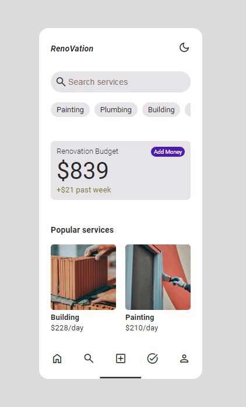
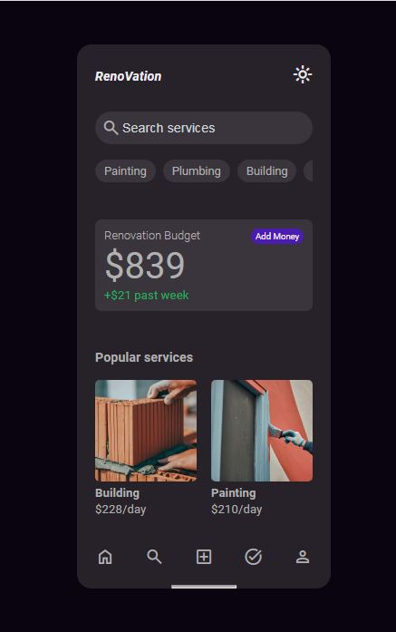

# Mobile App Renovation Service Service Screen:

A mobile screen design with switch theme option for building renovation service. 
It is made with HTML, Material Icons, CSS and JavaScript.

### Screenshots:
Here are some screenshots of the project:

### License

The project is licensed under the MIT License. See the [LICENSE](../../LICENSE) file for more details.

### Contact

If you have any questions or feedback, please feel free to reach me by referring [My Github Profile](https://github.com/ag-sanjjeev/)
